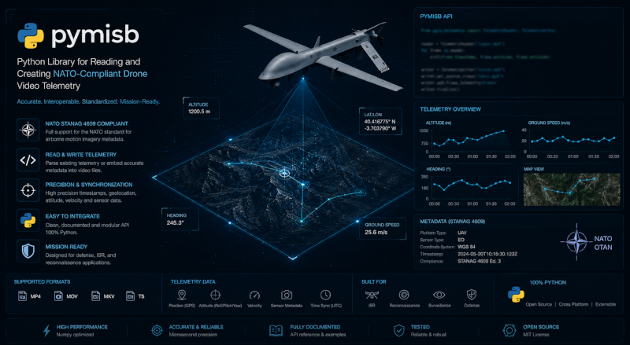

<p align="center">
  
</p>

# pymisb

[](https://github.com/All4Gis/pymisb/actions/workflows/ci.yml)
[](https://pypi.org/project/pymisb/)

**MISB ST0601 / STANAG 4609** mux, demux & live streaming library for Python.

| Module | What it does |
|--------|-------------|
| **mux** | Turn DJI drone footage + telemetry into STANAG 4609 videos with embedded KLV |
| **demux** | Extract and decode KLV telemetry from any STANAG-compliant video file |
| **stream** | Read KLV in real-time from live UDP/RTP/RTSP streams |
| **vmti** | Parse MISB ST 0903 VMTI target tracking metadata |

```bash
pip install pymisb
```

> **Donations** — If this project is useful for you, consider buying me a beer! [](https://www.paypal.com/donate/?hosted_button_id=YMHU4Z52S2G8N)

## Quick start

### Mux — create a MISB video

```python
from pymisb.common import build_klv_packets
from pymisb.mux import mux_with_ffmpeg

packets = build_klv_packets("telemetry.csv")
mux_with_ffmpeg("drone.mp4", packets, "output.ts")
```

### Demux — read KLV from a video

```python
from pymisb.demux import extract_klv, decode_packets

klv_data = extract_klv("output.ts")
packets = decode_packets(klv_data)
for pkt in packets:
    meta = pkt.MetadataList()
    print(meta[13])  # Sensor Latitude
```

### Stream — real-time KLV from live feeds

```python
from pymisb.stream import open_stream

with open_stream("udp://@:5000") as reader:
    for pkt in reader:
        meta = pkt.MetadataList()
        print(meta[13])  # Sensor Latitude in real-time
```

### VMTI — target tracking metadata

```python
from pymisb.vmti import parse_vmti, extract_vmti

targets = parse_vmti(extract_vmti("video.ts"))
for t in targets:
    print(t["target_centroid_lat"], t["target_classification"])
```

## Package structure

```
pymisb/
├── constants.py          Shared constants (keys, versions, FOV, etc.)
├── common/
│   ├── encoder.py        MISB ST0601 KLV packet builder
│   ├── dji.py            DJI CSV + binary .txt flight record parsers
│   └── ts.py             Path defaults and KLV stream writer
├── mux/
│   └── engine.py         MPEG-TS muxing (PES/PCR/KLV injection + FFmpeg)
├── demux/
│   └── engine.py         KLV extraction and decoding from files
├── stream/
│   └── engine.py         Real-time KLV from UDP/RTP/RTSP streams
├── vmti/
│   └── engine.py         MISB ST 0903 VMTI target metadata
└── klvdata/              Vendored MISB ST0601/0903 KLV decoder
```

## Requirements

- **Python 3.12+** (3.12, 3.13)
- **FFmpeg** on the PATH (for muxing, demuxing, and streaming)

## Installation

### From PyPI

```bash
pip install pymisb
```

### From source

```bash
git clone https://github.com/All4Gis/pymisb.git
cd pymisb
pip install .
```

### Development (editable)

```bash
git clone https://github.com/All4Gis/pymisb.git
cd pymisb
pip install -e ".[test]"
```

### Verify

```bash
python -c "from pymisb.constants import UAS_LS_KEY; print('OK')"
pymisb-mux --help
pymisb-demux --help
```

## CLI usage

### Muxing

```bash
# From DJI CSV telemetry
pymisb-mux --video drone.mp4 --csv telemetry.csv
pymisb-mux --video drone.mp4 --csv telemetry.csv --out output.ts

# From DJI binary .txt flight record
pymisb-mux --video drone.mp4 --dji-txt DJIFlightRecord.txt

# KLV only (no video muxing)
pymisb-mux --csv telemetry.csv --out output.ts --klv-only

# Or via module
python -m pymisb.mux --video drone.mp4 --csv telemetry.csv
```

### Demuxing

```bash
# Dump all KLV packets
pymisb-demux output.ts

# Playback at the video's real rate
pymisb-demux output.ts --play

# Accelerated playback x4
pymisb-demux output.ts --play --speed 4

# Show every ST0601 tag
pymisb-demux output.ts --all

# Tag tree of the first packet
pymisb-demux output.ts --structure
```

### Streaming (live)

```bash
# Read KLV from a live UDP stream
pymisb-stream udp://@:5000

# RTSP camera
pymisb-stream rtsp://camera.local/stream --all

# Or via module
python -m pymisb.stream udp://@:5000
```

### VMTI (target tracking)

```bash
# Decode VMTI targets from a video
pymisb-vmti video.ts

# Show all target fields
pymisb-vmti video.ts --all
```

## Library API

### `pymisb.common` — encoder and parsers

```python
from pymisb.common import (
    build_st0601_packet,       # Build a single ST0601 KLV packet
    build_klv_packets,         # Parse DJI CSV -> list of KLV packets
    build_klv_packets_from_txt, # Parse DJI .txt -> list of KLV packets
    default_output,            # Generate default output path
    write_klv_stream,          # Write packets as raw KLV file
)
```

### `pymisb.mux` — MPEG-TS muxing

```python
from pymisb.mux import (
    mux_with_ffmpeg,       # Full mux pipeline (FFmpeg + KLV injection)
    inject_klv_into_ts,    # Low-level: inject KLV into existing TS
)
```

### `pymisb.demux` — KLV extraction and decoding from files

```python
from pymisb.demux import (
    extract_klv,           # Extract raw KLV bytes from TS via FFmpeg
    decode_packets,        # Decode raw KLV into parsed ST0601 packets
)
```

### `pymisb.stream` — real-time KLV from live streams

```python
from pymisb.stream import open_stream

# Iterator mode — yields packets as they arrive
with open_stream("udp://@:5000") as reader:
    for pkt in reader:
        meta = pkt.MetadataList()
        print(meta[13])

# Callback mode
def on_packet(pkt):
    print(pkt.MetadataList()[13])

reader = open_stream("rtsp://camera.local/stream")
reader.start(callback=on_packet)
reader.stop()
```

### `pymisb.vmti` — MISB ST 0903 VMTI target tracking

```python
from pymisb.vmti import parse_vmti, extract_vmti, decode_vmti_stream

# From a TS file
targets = parse_vmti(extract_vmti("video.ts"))
for t in targets:
    print(t["target_centroid_lat"], t["target_classification"])

# From raw bytes
targets = decode_vmti_stream(vmti_bytes)
```

### `pymisb.constants` — shared configuration

```python
from pymisb.constants import (
    UAS_LS_KEY,            # 16-byte UAS Datalink Local Set universal key
    KLV_HEADER_KEY,        # Shifted key for DJI non-standard headers
    ST0601_VERSION,        # MISB ST0601 version (Tag 65)
    HFOV_DEG, VFOV_DEG,   # Camera field of view (degrees)
    EARTH_MEAN_RADIUS,     # WGS-84 radius in meters
)
```

## Configuration

Edit `pymisb/constants.py` to adjust:

- `HFOV_DEG` / `VFOV_DEG` — camera field of view (affects sensor footprint)
- `ST0601_VERSION` — advertised Local Set version (Tag 65)

## Supported standards

| Standard | Name | Status |
|----------|------|--------|
| MISB ST 0601 | UAS Datalink Local Set | Full (encode + decode) |
| MISB ST 0903 | VMTI (Video Moving Target Indicator) | Decode |
| MISB ST 0102 | Security Metadata | Decode (via klvdata) |
| MISB EG 0104 | UAV Basic Universal Metadata | Decode (via klvdata) |
| STANAG 4609 | NATO video standard | Full (mux + demux) |

## Testing

```bash
# Install with test dependencies
pip install -e ".[test]"

# Run all tests
pytest tests/ -v

# Run specific test file
pytest tests/test_misb_common.py -v

# Run specific test
pytest tests/test_misb_common.py::TestBuildSt0601Packet -v

# With coverage
pip install pytest-cov
pytest tests/ --cov=pymisb --cov-report=term-missing
```

| Test file | Coverage |
|-----------|----------|
| `tests/test_misb_common.py` | ST0601 encoder, DJI parsers, BER/BCC, geometry |
| `tests/test_misb_mux.py` | MPEG-TS primitives (PES, PTS, PCR, packetization) |
| `tests/test_klvdata.py` | Vendored klvdata decoder (ST0601 tags, BER-TLV, integration) |

CI runs on every push across Python 3.12-3.13 on Linux, macOS, and Windows.

## Publishing

```bash
# Build
pip install build
python -m build

# Publish to PyPI
pip install twine
twine upload dist/*

# Or TestPyPI first
twine upload --repository testpypi dist/*
pip install --index-url https://test.pypi.org/simple/ pymisb
```

## License

This project is licensed under the [MIT License](LICENSE).

The vendored `klvdata` decoder in `pymisb/klvdata/` is derived from
[paretech/klvdata](https://github.com/paretech/klvdata) (MIT). See
[THIRD_PARTY_LICENSES.md](THIRD_PARTY_LICENSES.md) for full attribution.

---

> _"From raw drone footage to geospatial intelligence — one KLV packet at a time."_

Made with passion by **Fran Raga** <franka1986@gmail.com> - June 2026.

If this saved you a few hours, give the repo a star and fly safe. Happy coding!
